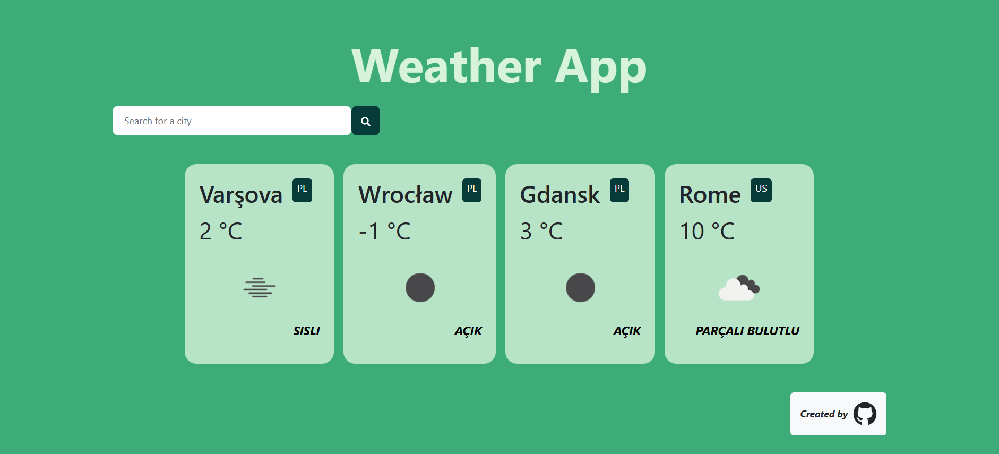
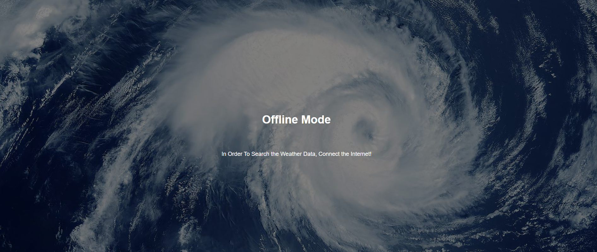

# Weather App PWA

This is a Progressive Web App (PWA) for displaying weather information.

## Features

- Current weather conditions
- Search for weather by city
- Location permission
- Error notification
- Offline support

## Live Demo

You can view the live demo of the app [here](https://friendly-manatee-6c0096.netlify.app/).

## Screenshots




## Download

You can download the app on your mobile or web browser for offline use.

## Installation

1. Clone the repository:
    ```sh
    git clone https://github.com/KemalDurukanMERT/weather-app-pwa
    ```
2. Navigate to the project directory:
    ```sh
    cd weather-app-pwa
    ```
3. Install dependencies:
    ```sh
    npm install
    ```

## Usage

1. Start the development server:
    ```sh
    npm start
    ```
2. Open your browser and go to `http://localhost:3000`.

## Build

To create a production build, run:
```sh
npm run build
```

## Team Members
Kemal Durukan Mert
Sefa Akkaya
Bahadir Gulen
